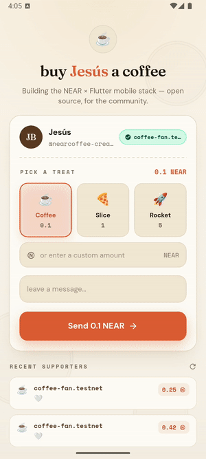

# ☕ NearCoffee

> Buy your favourite NEAR builder a coffee — a tip jar built **entirely on the
> published NEAR Flutter SDK**.

<p align="center">
  
</p>

<p align="center">
  <a href="https://pub.dev/packages/near_dart"></a>
  <a href="https://pub.dev/packages/near_wallet_connect"></a>
  
  
</p>

One Dart codebase → **iOS · Android · Web · Desktop**. Connect a wallet, pick a
treat (or type any amount), leave a message — your tip is **signed by your wallet
and settles on-chain**, then prints a receipt with a link to the block explorer.

---

## Why a tip jar, not "just paste your wallet address"?

Sending NEAR to an address is a commodity — two lines of code. The product is
everything _around_ the transfer:

- **Identity & trust** — a page with a name, avatar and bio, not a scary hex string.
- **Two taps** — preset amounts (☕ / 🍕 / 🚀) or a custom one; the wallet is handled for you.
- **The social layer** — a message + a public, on-chain supporters wall.
- **0% fees, global, instant** — and verifiable on-chain. No Stripe, no Patreon cut.

## Built with

| Package | Role |
|---|---|
| [`near_dart`](https://pub.dev/packages/near_dart) | RPC client, transaction building, Borsh, primitives |
| [`near_wallet_connect`](https://pub.dev/packages/near_wallet_connect) | drop-in MyNearWallet connect + `NearConnectButton` |

Plus `google_fonts`, `url_launcher`, `app_links`, `shared_preferences`.

## How it works

```
┌────────────┐  connect  ┌──────────────┐  function-call key  ┌────────────┐
│  NearCoffee │ ────────▶ │ MyNearWallet │ ──────────────────▶ │  the app   │
└────────────┘           └──────────────┘                     └────────────┘
      │  read the wall (view call) ─────────────────────────────────▶ on-chain
      │  tip (signed by your wallet, per-transaction) ──────────────▶ on-chain
```

**1. Read the supporters wall** — a free, read-only view call:

```dart
final res = await client.callFunction(
  accountId: AccountId('nearcoffee-jar.testnet'),
  methodName: 'get_tips',
  args: {'from_index': from, 'limit': 12},
  blockReference: BlockReference.finality(Finality.final_),
);
```

**2. Tip — signed by the wallet, per transaction.**

> 💡 **The deposit gotcha.** Connecting a wallet gives the app a NEAR
> *function-call key*. By protocol rule, **function-call keys cannot attach a
> deposit** — they're for gas-only contract calls. A tip *is* a deposit, so it
> must be signed by your wallet's **full-access key**. NearCoffee therefore builds
> the transaction and hands it to MyNearWallet's `/sign` flow: you approve it, the
> wallet signs + sends, and the app shows the receipt when it redirects back.

```dart
// build the tip and let the wallet sign it
final tx = Transaction(
  signerId: signer.accountId,
  receiverId: AccountId('nearcoffee-jar.testnet'),
  publicKey: signer.keyPair.publicKey,
  nonce: nonce + BigInt.one,
  blockHash: CryptoHash(blockHash),
  actions: [
    FunctionCallAction(methodName: 'tip', args: {'message': message},
        deposit: NearToken.parse('1')), // 1 NEAR ≈ a coffee
  ],
);
final url = adapter.buildTransactionUrl(transactions: [tx]);
await launchUrl(url); // → MyNearWallet → approve → back to the app
```

This is the correct pattern for **payments** on NEAR, verified on testnet
([example tx](https://testnet.nearblocks.io/txns/BkA4BuDMQ3gYm67LypocdoPeqnqt9BsKRnRfeGEBjz4r)).

## The smart contract

Tips settle through a tiny tip-jar contract (in [`contract/`](contract/), ~70
lines of Rust / near-sdk 5). `tip(message)` is payable: it records the supporter +
message on-chain **and forwards the deposit to the creator**; `get_tips` is the
public wall.

```rust
#[payable]
pub fn tip(&mut self, message: String) -> U128 {
    let amount = env::attached_deposit();
    self.tips.push(Tip { account_id: env::predecessor_account_id(), /* … */ });
    Promise::new(self.beneficiary.clone()).transfer(amount); // → the creator
    U128(self.tips.len() as u128)
}
```

Deployed on testnet: [`nearcoffee-jar.testnet`](https://testnet.nearblocks.io/address/nearcoffee-jar.testnet)
(beneficiary `nearcoffee-creator.testnet`).

```bash
cd contract
rustup target add wasm32-unknown-unknown
cargo build --target wasm32-unknown-unknown --release
near deploy <you>.testnet target/wasm32-unknown-unknown/release/tip_jar.wasm \
  --initFunction new --initArgs '{"beneficiary":"<creator>.testnet"}'
```

## Run it

```bash
flutter pub get
flutter run -d chrome        # or any connected device / emulator
```

Edit [`lib/creator.dart`](lib/creator.dart) to make the jar yours (name, handle,
bio, tip tiers).

## Project structure

```
lib/
├── main.dart            # app entry, theme, wallet controller
├── home_page.dart       # the jar: tiers, custom amount, message, send + receipt
├── near_service.dart    # RPC reads (supporters wall) via near_dart
├── wallet_tip.dart      # per-transaction wallet signing for tips
├── receipt_sheet.dart   # the printed receipt (the signature moment)
├── creator.dart         # creator profile + tip tiers (edit to re-skin)
├── theme.dart           # "warm receipt" design tokens + fonts
├── atmosphere.dart      # paper-grain background + coffee-ring stains
└── widgets.dart         # PaperCard, DashedLine, TornEdge, CoffeeButton, …
contract/                # the Rust tip-jar smart contract
docs/demo/               # recorded demos (Android + the sign flow)
```

## Design

A warm paper receipt: cream canvas, espresso ink, a terracotta call to action, and
NEAR mint reserved for the single *settled on-chain* moment. Fraunces for display,
DM Sans for UI, Space Mono for the receipt.

## License

[MIT](LICENSE) © 0xJesus
